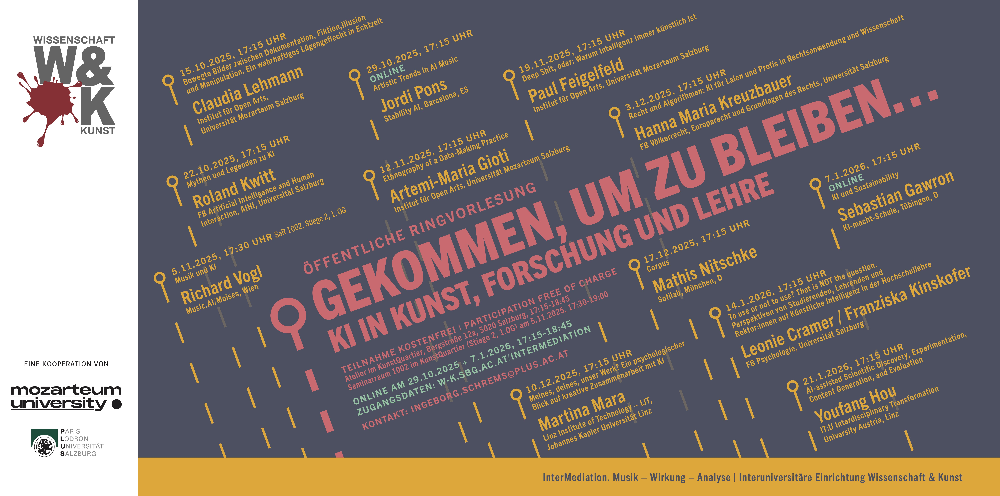

# AI Eingangswerstatt (VO)

## Ankündigungen

- (17-Okt-2025) Öffentliche Ringvorlesung im WS 25/26: [**Gekommen, um zu bleiben…: KI in Kunst, Forschung und Lehre**](https://w-k.sbg.ac.at/veranstaltung/gekommen-um-zu-bleiben-ki-in-kunst-forschung-und-lehre/)

    

- (17-Okt-2025) Für die Veranstaltungen von **KI+ME** (Theaterperformance sowie 3 Diskussionsrunden) kann man sich hier [zu den Veranstaltungen anmelden](https://www.argekultur.at/projekte/2025/openmindfrequently/ki-and-me/).
Die Diskussionsrunden sind eine Kooperation von [ARGE Kultur Salzburg](https://www.argekultur.at/) mit dem [Programmbereich InterMediation](https://w-k.sbg.ac.at/intermediation-musik-wirkung-analyse-2024-2028/) an der interuniversitären Einrichtung [Wissenschaft & Kunst](https://w-k.sbg.ac.at/).

## LV LeiterInnen

- Univ.-Prof. Dr. Christine Bauer
- Univ.-Prof. Dr. Roland Kwitt

## Prüfungstermine

### Einführung AI (1 SSt. Variante für BA Informatik)

| | Datum, Zeit, Ort |
|--------|----------------|
| 1. Termin | 21.01.2026, 13:15-14:15 (T01) |
| 2. Termin | 04.02.2026, 11:00-12:00 (T01) |
| 3. Termin | 24.02.2026, 15:30-17:00 (T01) |

### AI Eingangswerkstatt (2 SSt. Variante für BA AI)

| | Datum, Zeit, Ort |
|--------|----------------|
| 1. Termin | 04.02.2026, 11:00-12:00 (T01) |
| 2. Termin | 24.02.2026, 15:30-17:00 (T01) |
| 3. Termin | 12.03.2026, 11:15-12:45 (T01) |

## Neuigkeiten

- Der prüfungsrelevante Stoff für die *Einführung AI (511.061)* umfasst alle Folien bis inkl. 05-Dez-2025 (die letzte prüfungsrelevante Folie ist mit einem grünen Oval markiert)!

- Folien Update (05-Dez-2025)

- **Ort/Zeit** der Lehrveranstaltung: **Hörsaal II - Lise Meitner (JAK2AUG0.69) (Fr., 10:30-12:00)** (siehe PLUS Online, in Itzling, Jakob-Haringer Str. 2, FB CPM im Untergeschoss)

## Allgemeines

Die Vorlesung (2 SSt.) ist Teil der STEOP (Studieneingangs und Orientierungsphase), die jede/jeder Studierende zu Beginn des **Bachelorstudiums AI** absolvieren muss. Sinn und Zweck der STEOP ist es, das Studium auszuprobieren, sowie die Grundlagen des Faches kennenzulernen.

Für Studierende des **Bachelorstudiums Informatik** ist die LV *einstündig* (1 SSt.). Wir werden jedoch trotzdem 90min Slots nutzen und der letzte LV-Termin ist für BA Informatik Studierende daher schon am *5. Dezember '25*. Prüfungsinhalt ist natürlich nur der Stoff bis inklusive dieser LV-Einheit.

## Inhalt

Die Vorlesung *AI Eingangswerstatt* führt Studierende in das Studium (Aufbau, Ablauf, Grundsätzliches zum Studieren an der PLUS) und das Fach *Artificial Intelligence* ein. Im Fokus des fachlichen Teils der VO stehen (u.a.) die Geschichte des Faches, deren Teilgebiete, wichtige (und neue) Anwendungsfelder sowie eine Beleuchtung der Ziele von AI aus verschiedenen Blickwinkeln und Herangehensweisen.

## Benotung

**Schriftliche Prüfung** am Ende des Semesters (und im Laufe des Sommersemesters '26). Es werden **drei** Termine angeboten.

### Nutzung von AI Tools

Unerlaubte Hilfsmittel (also auch AI Tools) sind nicht zulässig, siehe [§ 2a HS QSG](https://www.jusline.at/gesetz/hs-qsg/paragraf/2a) und den [Leitfaden zur Verwendung von KI-Werkzeugen](https://im.sbg.ac.at/spaces/QM/pages/303891131/Leistungs%C3%BCberpr%C3%BCfung?preview=/303891131/490639350/Leitfaden%20KI%20und%20schriftliche%20Arbeiten%20im%20Studium%20v2025-09%20LOGO.pdf).

## Unterlagen (Folien)

Als Lehrveranstaltungsunterlagen dienen die Folien. Im Laufe der VO kann es sein, dass wir die Folien aktualisieren. Wir werden den unten stehenden Link immer mit einem Datum versehen, sodass es klar ist, um welche Version der Folien es sich handelt. Bitte nutzen Sie als Vorbereitung auf die Prüfung die **aktuellste** Version der Folien. 

- [Folien](slides.pdf) (Stand: bis inkl. 19-Dez-2025)

## Literatur

Die empfohlene Literatur zur VO ist die englische Version des Klassikers *Artificial Intelligence: A Modern Approach (4th ed.)* von Stuart Russel und Peter Norvig (RN). Ausgewählte Kapitel sind [hier](https://plusacat-my.sharepoint.com/:f:/g/personal/roland_kwitt_plus_ac_at/EiOlzW4rY2NHqD_bmb241LIBTwEguTd-5HThY3X42jrkFQ?e=xws7aH).
